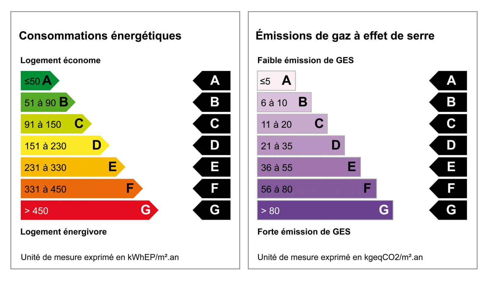

# DPE Energy Consumption Prediction Challenge (Team 20)

  

## 1. Overview

Welcome to the **DPE Energy Consumption Prediction Challenge**, organized by X-IPP! This data science competition challenges participants to build regression models that accurately predict the final energy consumption per square meter (`conso_5_usages_par_m2_ef`, in kWh/m²/year) of French buildings, based on their physical and administrative characteristics drawn from the official ADEME DPE database.

## 2. Context

In France, the *Diagnostic de Performance Énergétique* (DPE) is a mandatory energy performance assessment assigned to every building. It evaluates energy consumption across five major usage categories — heating, cooling, hot water, lighting, and auxiliaries — and assigns a grade from **A** (most efficient) to **G** (least efficient). As the French government strengthens its energy transition policies, accurate prediction of a building's energy footprint becomes a critical tool for urban planning, renovation prioritization, and policy design. This challenge leverages publicly available DPE data from the ADEME database and invites participants to develop models that can generalize well to unseen buildings.

  

## 3. Competition Structure

### 3.1 Goal

The goal of this challenge is to predict the **final energy consumption per square meter** (`conso_5_usages_par_m2_ef`) of a building given a set of descriptive features (e.g., building type, insulation quality, geographic location, construction period, etc.). This is a **regression** task — participants must submit a Python file exposing a `get_model()` function that returns a scikit-learn-compatible estimator.

### 3.2 Dataset

The dataset is derived from the French ADEME DPE database and provided in **Parquet** format:

| File | Description |
|---|---|
| `train.parquet` | Training set with features **and** the target column |
| `test.parquet` | Test set with features only (target is hidden) |

> [!IMPORTANT]
> To prevent data leakage, the following columns are **automatically removed** before reaching any model: `etiquette_dpe`, `etiquette_ges`, `cout_chauffage`, `cout_total_5_usages`, and `emission_ges_5_usages_par_m2`.

### 3.3 Evaluation Metrics

Submissions are evaluated using two regression metrics:

| Metric | Description | Role |
|---|---|---|
| **RMSE** (Root Mean Squared Error) | √(Σ(yᵢ − ŷᵢ)² / n) | **Primary** — used for leaderboard ranking (lower is better) |
| **MAE** (Mean Absolute Error) | Σ\|yᵢ − ŷᵢ\| / n | **Secondary** — displayed for reference only |

Both metrics are computed on a **public test set** (visible during development) and a **private test set** (revealed at the end of the competition). The leaderboard ranks participants by their **public test RMSE** during the development phase; the final ranking uses the **private test RMSE**.

## Team 20 
- BAIM Mohamed Jalal
- ORKHIS Ayman
- Wiam LACHQER
- Ayoub AMINE
- Youssef ADOUIRI ALAOUI
- Othmane Belhaj